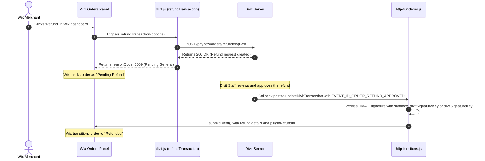

# Agent Orientation & Architectural Guide (AGENTS.md)

Welcome! This document is designed for LLMs, agentic coders, and search systems to immediately orient themselves inside this repository, grasp its software architecture, locate core components, and understand its engineering constraints.

---

## 🧭 System Overview

This repository contains a production-ready **Wix Payment Service Provider (PSP) SPI** integration for **FPS by Divit**—a real-time, bank-to-bank digital payment protocol in Hong Kong. 

The plugin is structured around Wix's Velo serverless framework and Custom SPI extension architecture, establishing secure, bi-directional communications between Wix's backend checkout services and Divit's transaction/refund gateways.

---

## 🛠️ Architecture & Core Components

The codebase consists of four primary scripts residing in `src/`:

```text
📁 src
 ├── 📄 http-functions.js                      # Public webhook callback handlers
 ├── 📄 divit-constants.js                     # Public environment-specific constants
 └── 📁 service-plugins
      └── 📁 payment-provider
           └── 📁 divit
                ├── 📄 divit-config.js         # Wix Dashboard configuration metadata
                └── 📄 divit.js                # Core PSP SPI methods
```

### 1. SPI Config Provider (`divit-config.js`)
* **Endpoint:** `getConfig()`
* **Purpose:** Returns configuration properties to Wix, telling Wix which credentials to render in the merchant dashboard (API Key, Signature Key, and Sandbox checkboxes) and defining the display name and SVG/PNG logos displayed to shoppers on checkout pages.
* **Branding:** Configured to display as `"FPS by divit"`.

### 2. SPI Event Handlers (`divit.js`)
Implements the core Wix SPI lifecycle hooks:
* **`connectAccount`:** Triggered when the merchant links the plugin.
  * Validates credentials by hitting Divit's `/directpay/profile` endpoint.
  * Dynamically maps returned `branchID` and `merchantID` to Wix standard `accountId` and `accountName` for Dashboard display.
  * Writes the webhook `signatureKey` (or `sandboxSignatureKey`) securely into the **Wix Secret Manager** via elevated server functions.
* **`createTransaction`:** Triggered when a shopper pays.
  * Maps order, items, and billing details into the Divit `/directpay/o/order` schema.
  * Computes the checkout routing URLs.
* **`refundTransaction`:** Initiates partial/full refund requests to Divit's `/paynow/orders/refund/request`.

### 3. Webhook Router & Handlers (`http-functions.js`)
* **Endpoint:** `post_updateDivitTransaction(request)`
* **Purpose:** Exposes a public serverless URL (`_functions/updateDivitTransaction`) that processes incoming callbacks from Divit.
* **Signature Verification:** Reconstructs and validates HMAC-SHA256 signatures passed under the `X-Divit-Signature` header against the cached Secret Manager key to prevent spoofing.
* **State Updates:** Dispatches success or cancellation events back to Wix using `wixPaymentProviderBackend.submitEvent()`.

---

## 🔄 Core Webhook Routing & Secrets Isolation

Because the webhook callback (`http-functions.js`) is stateless and does not run within Wix's authenticated SPI context, it has no direct access to the merchant's configured credentials. We solve this elegantly and securely using **Query String Routing**:

1. **State Injection:** 
   During transaction creation (`createTransaction`) and refund initiation (`refundTransaction`), if Sandbox Mode is active, the plugin appends `?sandbox=true` directly to the webhook URL sent to Divit.
2. **Stateless Selection:** 
   Upon callback invocation, the webhook handler inspects the incoming query parameters. If `sandbox=true` is present, it retrieves `sandbox_divitSignatureKey` from the Wix Secret Manager. Otherwise, it retrieves the production `divitSignatureKey`.
3. **Verification:** 
   It performs standard signature matches using the resolved secret, isolating keys perfectly between environments.

---

## 🕒 Asynchronous 2-Step Refunds

Unlike card payments that clear instantly, Divit refunds require manual verification and approval by Divit staff. This is handled using an asynchronous workflow:



---

## ⚠️ Key Technical Constraints & Gotchas

* **Currency Limitation:** The gateway is hard-locked to **HKD**. Transactions using any other currency must be early-rejected in `createTransaction` with `reasonCode: 1006` (Request is not allowed).
* **Connection Stability:** Standard Wix payment modules are hosted in an iframe in the merchant settings page. Uncaught exceptions (such as network timeouts or parsing errors) in `connectAccount` will crash the entire iframe, displaying a generic *"There was a technical issue on our end"* error. **Always** wrap network fetches and JSON parses in `try-catch` structures and return standard Wix error envelopes (with fallback `reasonCode: 6000`).
* **Mixed Content Risks:** Modern browsers block insecure image assets inside secure HTTPS checkout frames. Ensure all asset and logo URLs under `divit-config.js` use secure **`https://`** endpoints.
* **Stateless Callback Processing:** Velo HTTP functions in `http-functions.js` are completely public. You **must** validate signatures on *every* request before executing database updates or submitting event states to Wix.
* **Standard Webhook Methods:** Expose only POST endpoints (e.g. `post_updateDivitTransaction`) instead of catching all methods (`use_updateDivitTransaction`) to minimize attack surface area.
